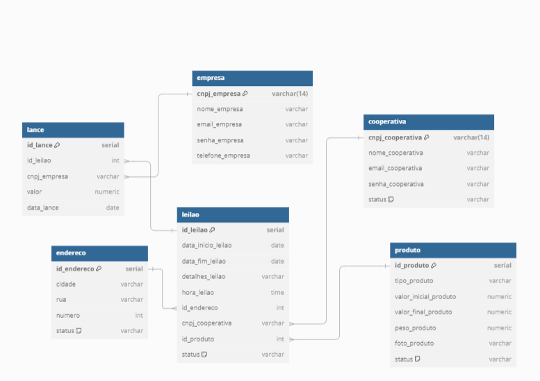

# Documentação do Banco de Dados Normalizado

## Objetivo
O banco de dados foi normalizado a partir de uma estrutura inicial, visando a eliminação de redundâncias, melhoria na integridade dos dados, e a implementação de tabelas de log e procedimentos para monitoramento e controle das operações realizadas.

## Tabelas Originais e Normalização

### Tabela Empresa (Original)
- CNPJ: Chave primária.
- Nome, Email, Senha, Telefone.

### Tabela Empresa (Normalizada)
- Divisão do CNPJ da empresa em uma tabela isolada, reduzindo redundância.
- Alteração do status de empresa para um valor padrão 'Ativo'.

### Tabela Endereço (Original)
- A tabela continha todos os campos relacionados ao endereço em uma única entidade.

### Tabela Endereço (Normalizada)
- Redução de campos redundantes.
- Criação de uma relação com tabelas associadas (Cooperativa, Empresa).

### Tabela Cooperativa (Original)
- CNPJ, Nome, Email, Senha, Telefone.

### Tabela Cooperativa (Normalizada)
- Implementação de status padrão 'Ativo'.
- Estrutura e campos otimizados.

### Tabela Produto (Original)
- Id, Material, Peso.

### Tabela Produto (Normalizada)
- Adição de campos de valor inicial e final do produto.
- Redução de redundância ao separar campos de status para um valor padrão.

### Tabela Leilão (Original)
- Detalhes do leilão incluíam campos como datas, hora de início e fim.

### Tabela Leilão (Normalizada)
- A relação entre o leilão e entidades como produto e cooperativa foi mantida com a inclusão de chaves estrangeiras.

### Tabela Lance (Original)
- Relacionada à tabela Leilão e Empresa.

### Tabela Lance (Normalizada)
- Campos otimizados para incluir valor de lance, data e referência ao leilão e à empresa.

## Tabelas de Logs
Implementadas para capturar as alterações feitas nas tabelas principais (Empresa, Cooperativa, Leilão, Produto, Endereço, Lance). Cada operação realizada nas tabelas cria um registro em sua respectiva tabela de log.

## Tabelas e Relacionamentos

### Cooperativa
- cnpj_cooperativa: Chave primária, código identificador da cooperativa.
- Nome, Email, Senha.
- Status: Indicador de status ativo/inativo.

### Empresa
- cnpj_empresa: Chave primária, identificador da empresa.
- Nome, Email, Senha.
- Status: Indicador de status ativo/inativo.

### Endereço
- id_endereco: Chave primária.
- Cidade, Rua, Número, Status.

### Produto
- id_produto: Chave primária.
- Tipo de produto, Valor inicial e final, Peso, Foto, Status.

### Leilão
- id_leilao: Chave primária.
- Data de início e fim, Hora do leilão.
- Relações com id_endereco, cnpj_cooperativa, id_produto.

### Lance
- id_lance: Chave primária.
- Valor do lance, Data do lance.
- Relação com id_leilao e cnpj_empresa.

## Procedimentos Armazenados

### Insert Procedures:
Procedimentos criados para inserções em cada tabela (`insert_cooperativa`, `insert_empresa`, `insert_leilao`, `insert_produto`, `insert_lance`, `insert_endereco`). Validações de campos, como email válido, senha com pelo menos 8 caracteres, CNPJ com 14 dígitos, e outros campos específicos de cada entidade.

### Função de Trigger:
Criada para capturar as operações realizadas em cada tabela (inserção, atualização, deleção) e registrar as mudanças nas tabelas de log associadas. Exemplo: `func_log_cooperativa` captura alterações na tabela Cooperativa.

## Tabelas de Log:
Cada tabela possui uma tabela de log correspondente (`log_empresa`, `log_cooperativa`, `log_leilao`, etc.). Armazenam:
- Código da entidade.
- Data da alteração.
- Operação realizada (inserção, atualização, deleção).
- Usuário responsável pela operação.

## Modelo:

## Conclusão
O banco de dados normalizado está devidamente estruturado para permitir a manutenção eficiente dos dados, garantindo a integridade referencial através das chaves estrangeiras e utilizando tabelas de log para auditoria das operações. O uso de stored procedures permite uma maior segurança nas operações de inserção e atualização, com validações de dados essenciais.